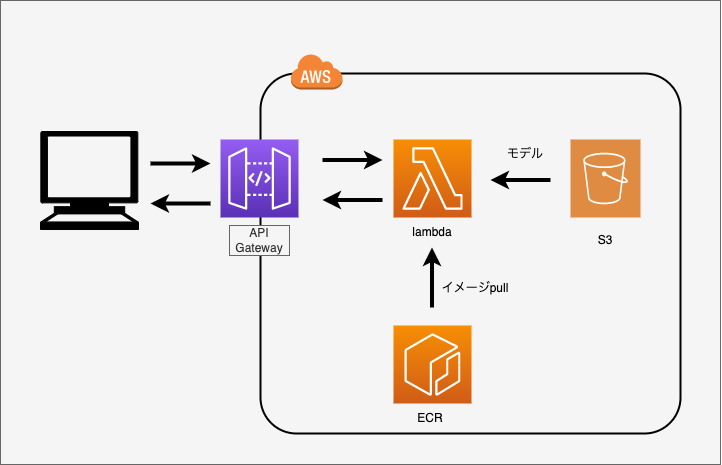

# サーバーレスな機械学習推論api
lambdaとfastapiを使って、サーバレスに機械学習の推論apiを作成する。

ネットワーク構成



# デプロイ手順
1. train.pyを実行し、S3に学習モデルをアップロードする。
※awscliの設定が必要です。

2. AWSECRに`api-lambda` という名前のリポジトリを作成する。

3. dockerをbuiltして、ECRにイメージをpushする。

```bash
# {userid}はAWSのアカウントID
# ログイン
aws ecr get-login-password --region ap-northeast-1 | docker login --username AWS --password-stdin {userid}.dkr.ecr.ap-northeast-1.amazonaws.com
# ビルド
docker build -t api-lambda .
docker tag api-lambda:latest {userid}.
dkr.ecr.ap-northeast-1.amazonaws.com/api-lambda:latest
# ecrへpush
docker push {userid}.dkr.ecr.ap-northeast-1.amazonaws.com/api-lambda:latest
```